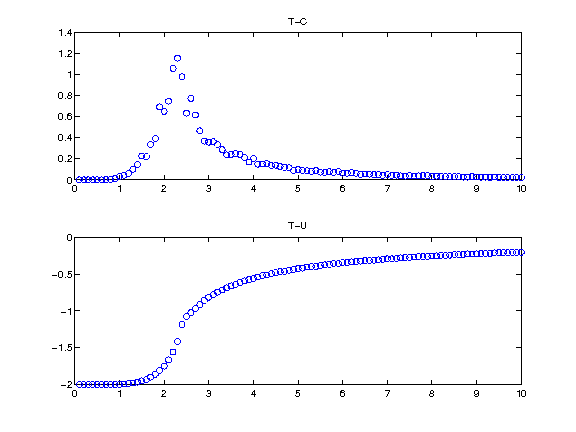
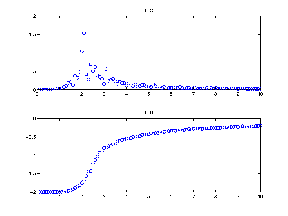
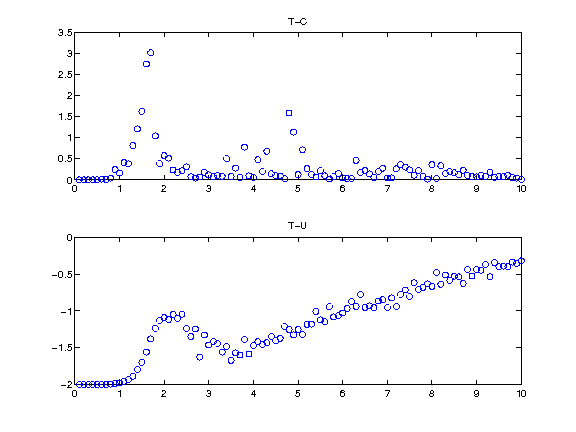
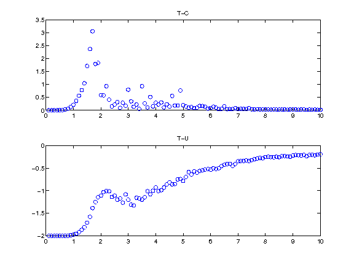
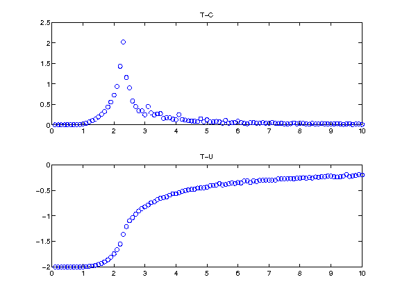

************************************************************
计算结果
************************************************************

Basic metropolis
============================================================

虽然在相变点附近模拟效果不好，但是每次迭代的代价小，也不随着晶格规模的增大而增大计算量。
多迭代一些也能得到比较好的结果。

 
 metropolis算法1e6次迭代

 
 metropolis算法1e5次迭代

从图上可以看出 :math:`\beta_c\sim =2.3` 能比较好的接近理论值2.26了。

Swendsen-Wang Algorithm
============================================================

Swendsen-Wang 算法计算代价比较高。

 
 Swendsen-Wang 算法 1e3次迭代

 
 Swendsen-Wang 算法 1e4次迭代
  
从图上可以看出 :math:`\beta_c\sim =1.8` 相比理论值要小一些。

The Modification by Wolff
==================================================

相比metropolis算法在相变点附近有更好的收敛性，又比Swendsen-wang算法更高效。
最重要的是他对相变点的估计比基本的metropolis算法要准确。

 
 wolff 算法 1e4 次迭代

从图上可以看出 :math:`\beta_c\sim =2.2` 与理论值最接近。

总结
==================================================

不论什么算法，舍去刚开始的一些结果之后会表现出更好的结果，尤其是温度低的时候。因为，如果
初始状态的能量距离平均能量太远的话，要很多步以后才能迭代到平均能量附近。
虽然Cluster算法能用更少的迭代得到更好的结果，但是每次迭代的代价比基本的metropolis算法要大许多。

