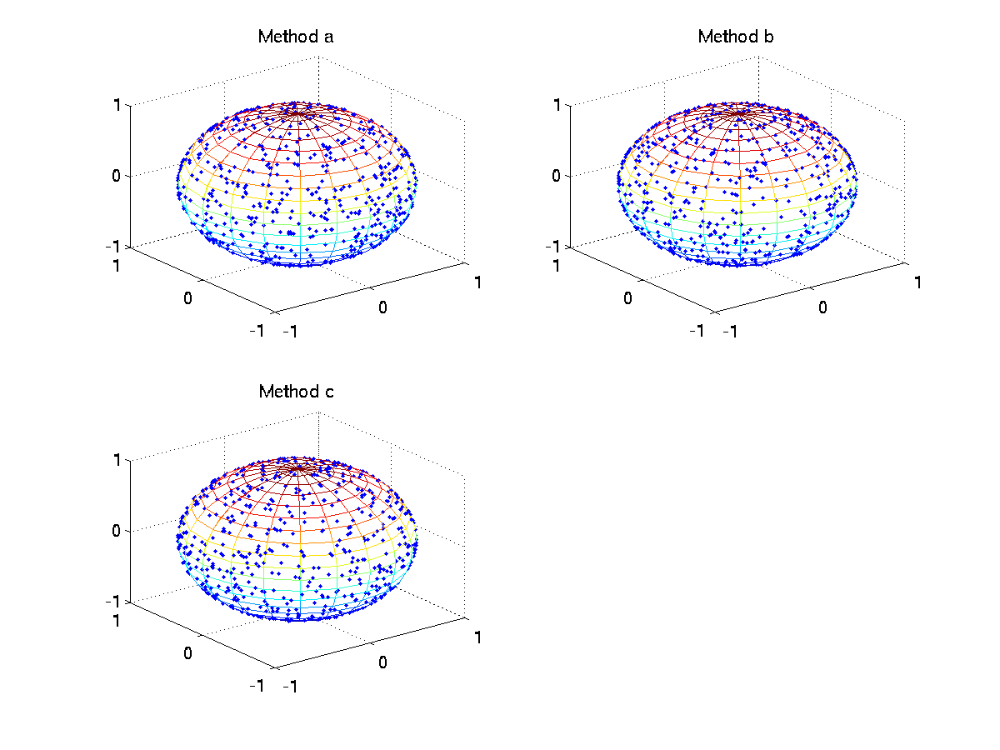

**************************************************
Applied Stochastic Analysis's home work 2
**************************************************

No.1
============

omitting..

No.2
=======
*Testify the half order convergence of MC through a numerical example.*

Here is the code:

.. literalinclude:: hw2_2.m
    :language: matlab
    :linenos:

No.3
=============
*How many ways can you give to construct the uniform distribution on* :math:`S^2` *. Implement them and make a comparison.* 

Set :math:`\theta` and :math:`\phi` be the spherical coordinates.
Here I got three mechod:

a. Let :math:`\theta` be the uniform distribution of :math:`[0,2\pi)` and :math:`P_{\phi}=\frac{1}{2}sin\phi`

.. math::
    
    x &= \cos \theta \sin \phi\\
    y &= \sin \theta \sin \phi\\
    z &= \cos \phi

b. pick  :math:`u=cos\phi` to be uniformly distributed on :math:`[-1,1]`, and :math:`\theta` the same as above.

.. math::
    
    x &= \sqrt{1-u^2} \cos\theta\\
    y &= \sqrt{1-u^2} \sin\theta\\
    z &= u
    

c. Marsaglia (1972) derived an elegant method that consists of picking :math:`x_1` and :math:`x_2`  from independent uniform distributions on :math:`(-1,1)` and rejecting points for which :math:`x_1^2+x_2^2\geq 1` . From the remaining points.

.. math::
    
    x &=2 x_1 \sqrt{1-x_1^2-x_2^2}\\
    y &=2 x_2 \sqrt{1-x_1^2-x_2^2}\\
    z &=1-2(x_1^2+x_2^2)\\

Here is the code:

.. literalinclude:: hw2_3.m
    :language: matlab
    :linenos:

And here is the result:

It's obvius that the method c is the most effient, but not stable.

a: Elapsed time is 0.026833 seconds.

b: Elapsed time is 0.020886 seconds.

c: Elapsed time is 0.006588 seconds.

PS: 
I. Another easy way to pick a random point on a sphere is to generate three Gaussian random variables.
#. Cook (1957) extended a method of von Neumann (1951) to give a simple method of picking points uniformly distributed on the surface of a unit sphere. This method only need multiply add, sub and divide.
