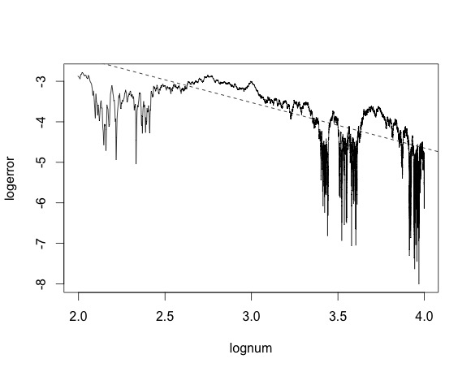
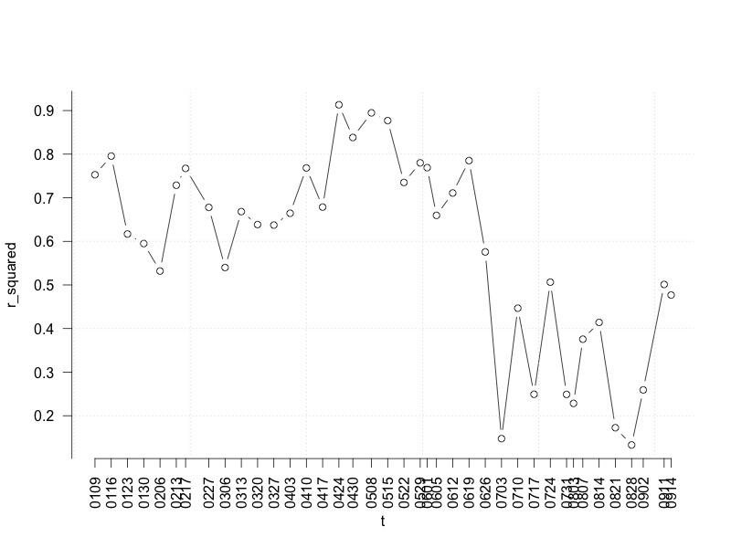
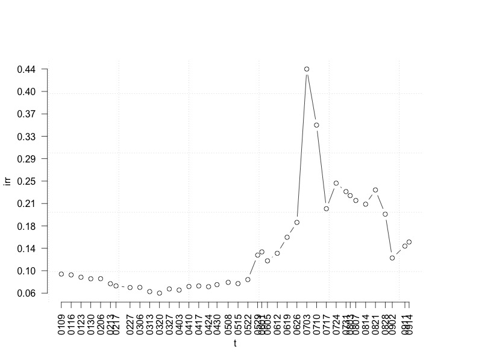
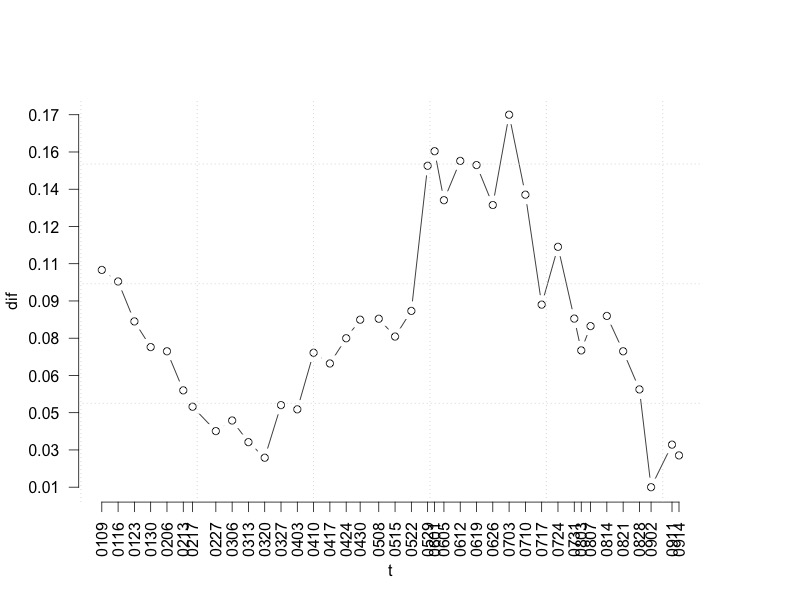
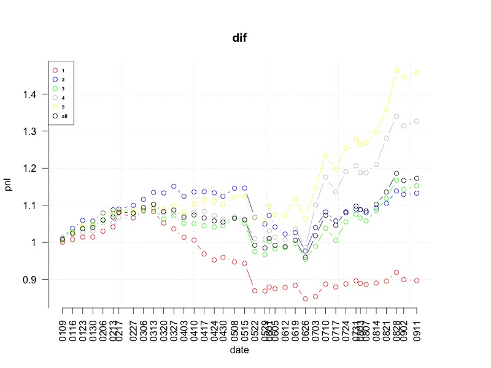
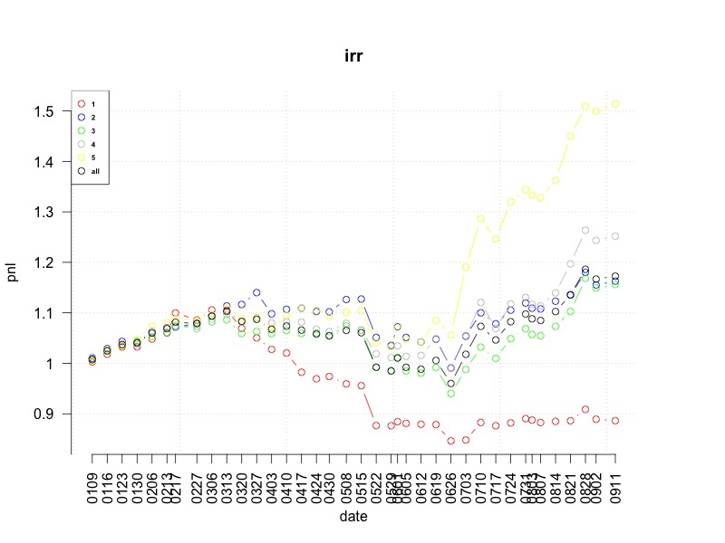

模拟结果
========================================

收敛性分析
------------------------------------------------------------

下图为计算次数与误差直接的双对数图. 可以看出这个模拟算法有一阶收敛性. 也就是说 :math:`误差=C/模拟次数`. 在我们接下来的模拟中取模拟次数为2000.

价格与NPV之间的线性模型
------------------------------------------------------------
这里我们考虑在同一个交易日内, 不同分级A的价格与我们模拟所得的NPV之间的线性关系. 其中150012和150022情况比较特殊, 他们的模拟结果没有放进来一起分析.

首先以20150424为例. 我们以成交量为权重做加权线性回归, 得到如下结果::

 Residual standard error: 239.8 on 38 degrees of freedom
 Multiple R-squared:  0.9198,	Adjusted R-squared:  0.9176 
 F-statistic: 435.5 on 1 and 38 DF,  p-value: < 2.2e-16

其中 :math:`R-squared=0.9198` 说明NPV对价格已经有比较好的解释度了. 

..
   回归结果为::

    (Intercept)      ss$npv 
     -2.374490    3.214891 

   一次项不是我们预期的 :math:`1` 左右, 而是 :math:`3.214891` , 说明市场价格对价值差异有一个比较大的过度反应.

如下图, 我计算了不同日期下的线性模型的R-squared, 可以看出在牛市行情中NPV对市场价格有一个比较好的解释, 进入7，8月剧烈震荡行情之后, 市场价格与NPV出现了较大偏离.

隐含收益率(IRR)分析
--------------------------------------------------

由隐含收益率和NPV的计算可以知道, 当NPV高于价格的时候, 价值被市场低估, IRR就会比较高. 随着价格波动, 隐含收益率会随之波动, 因为NPV相对市场波动来说是很稳定的. 

下图是平均隐含收益率对时间的函数, 可以看到5月22日开始平均隐含收益率有一个较大上升.

当前净值(NPV)分析
------------------------------------------------------------

除了分析IRR, 我们还可以直接分析 NPV 与市场价格之间的差. 定义 :math:`dif=(npv-price)/npv` 画出平均 dif 对时间的图形如下.

由于 IRR 考虑到了折现的时间, 所以在七八月份下跌的过程中, 存在较大下折预期的情况下, IRR会比较高.

盈利分析
------------------------------------------------------------

我们用 IRR 和DIF 作为指标, 将A基金分成五组, 假设每周调整一次分组, 分组内按交易量计算累积收益率. 我们可以得到如下两图:

