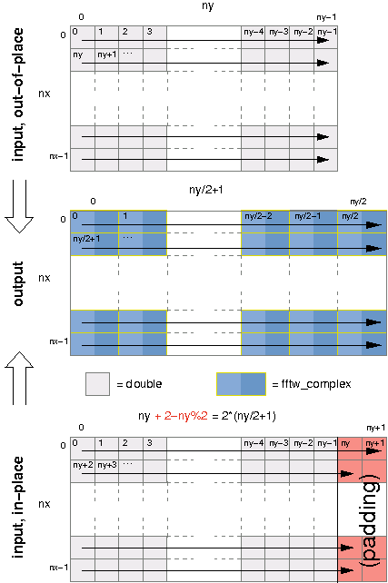

********************************************************************************
FFTW基本教程
********************************************************************************

基本教程介绍了怎样对单个数组做变换。基本介绍了真实情况，却没有完全严格介绍所有细节。在学习任何其他部分之前必须先学习Complex One-Dimensional DFTs部分。

.. index:: Complex One-Dimensional DFTs

Complex One-Dimensional DFTs 一维复变换
============================================================
The basic usage of FFTW to compute a one-dimensional DFT of size N is simple, and it typically looks something like this code

.. code-block:: c

     #include <fftw3.h>
     ...
     {
         fftw_complex *in, *out;
         fftw_plan p;
         ...
         in = (fftw_complex*) fftw_malloc(sizeof(fftw_complex) * N);
         out = (fftw_complex*) fftw_malloc(sizeof(fftw_complex) * N);
         p = fftw_plan_dft_1d(N, in, out, FFTW_FORWARD, FFTW_ESTIMATE);
         ...
         fftw_execute(p); /* repeat as needed */
         ...
         fftw_destroy_plan(p);
         fftw_free(in); fftw_free(out);
     }

编译过程中必须连接fftw3在unix系统下加下面编译参数::

 -lfftw3 -lm.

fftw_malloc 会利用在一定程度上比malloc高效，因为它使用可用的SIMD指令。同时还可以使用fftw_alloc_complex(N)完成例子中的内存分配。

fftw_complex是一个double[2]数组in[i][0]为实部分，in[i][1]为虚部。

下一步是生成plan::

     fftw_plan fftw_plan_dft_1d(int n, fftw_complex *in, fftw_complex *out,
                                int sign, unsigned flags);

第一个变量是需要做变换的数组大小，任意正整数，如果是小因子的乘积变换会更加高效，尽管对素数也是 O(n log n) 的复杂度。

接下来两个变量是指向输入输出数珠的指针。他们可以相等，表示in-place的变换。

第四个变量，sign，可以是FFTW_FORWARD (-1) 或者 FFTW_BACKWARD (+1) 表示变换的类型。

最后一个变量 flags 是 FFTW_MEASURE或者 FFTW_ESTIMATE. FFTW_MEASURE 指示 FFTW 去算几次FFT来找出对于长度n最好的算法。这会花相对多一点时间。相反，FFTW_ESTIMATE, 并不计算实际的FFT只是给出一个局部最优的算法。总之，如果要很多次重复使用这个plan，measure花的时间微不足道的话就用MEASURE 否则用ESTIMATE

必须在创建plan之后再初始化数据，因为FFTW_MEASURE会覆盖你的数据。

plan一旦生成，可以使用很多次，对特定的输入和输出,只要调用 fftw_execute(plan)::

     void fftw_execute(const fftw_plan plan);

结果保存在数组out里面 zero-frequency (DC)保存在out[0]中。如果指针in和out不相等，则in中的数据不会被改变。

如果要对相同大小的另一个数组做傅立叶变换，可以调用 fftw_plan_dft_1d ，这时候FFTW会在可能的情况下自动利用之前的信息。如果你足够细心有耐心，当然也是可以用专家接口将一个plan应用到别的数组上去。

完成plan之后，需要销毁plan fftw_destroy_plan(plan)::

     void fftw_destroy_plan(fftw_plan plan);

用fftw_free() 来释放 fftw_malloc() 申请的内存，不要用free() 和delete。FFTW算的是没有正规化的DFT，所以做一次正变换在做一次逆变换之后结果是原来的n倍。参看 `FFTW Really Computes <http://notes.yeshiwei.com/fftwdoc/html/What-FFTW-Really-Computes.html#What-FFTW-Really-Computes>`_.

如果你的C编译器支持C99标准，并且在 <fftw3.h>之前 #include<complex.h>，那么fftw_complex就是内建的complex 类，否则FFTW定义了自己的complex类。更多细节请参看 `Complex numbers <http://notes.yeshiwei.com/fftwdoc/html/Complex-numbers.html#Complex-numbershttp://notes.yeshiwei.com/fftwdoc/html/Complex-numbers.html#Complex-numbers>`_

(The C++ <complex> template class may also be usable via a typecast.)
ps： To use single or long-double precision versions of FFTW, replace the fftw\_ prefix by fftwf\_ or fftwl\_ and link with -lfftw3f or -lfftw3l, but use the same <fftw3.h> header file.

除了 FFTW_MEASURE 和 FFTW_ESTIMATE还有别的flag. 比如 FFTW_PATIENT 如果愿意等更长的时间来获得更高效的算法。 (see `FFTW Reference <http://notes.yeshiwei.com/fftwdoc/html/FFTW-Reference.html#FFTW-Reference>`_ ).
还可以保存plan以后使用，参看 `Words of Wisdom-Saving Plans <http://notes.yeshiwei.com/fftwdoc/html/Words-of-Wisdom_002dSaving-Plans.html#Words-of-Wisdom_002dSaving-Plans>`_ .

.. index:: Complex Multi-Dimensional DFTs

Complex Multi-Dimensional DFTs
======================================================================

基本和一维相同。
Multi-dimensional transforms work much the same way as one-dimensional transforms: you allocate arrays of fftw_complex (preferably using fftw_malloc), create an fftw_plan, execute it as many times as you want with fftw_execute(plan), and clean up with fftw_destroy_plan(plan) (and fftw_free). The only difference is the routine you use to create the plan::

     fftw_plan fftw_plan_dft_2d(int n0, int n1,
                                fftw_complex *in, fftw_complex *out,
                                int sign, unsigned flags);
     fftw_plan fftw_plan_dft_3d(int n0, int n1, int n2,
                                fftw_complex *in, fftw_complex *out,
                                int sign, unsigned flags);
     fftw_plan fftw_plan_dft(int rank, const int *n,
                             fftw_complex *in, fftw_complex *out,
                             int sign, unsigned flags);

上述函数分别创建n0 乘 n1 的2维变换，n0乘以n1乘以n2的3维变换，以及任意rank维的变换的plan。对于第三个函数，n是指向n[rank]数组的指针，表示n[0]乘n[1]乘...乘n[rank-1]维的变换。所有这些变换处理C标准的连续行优先的数组，于是读取最后一维变化的数据的时候最快。 This layout is described further in Multi-dimensional Array Format.

You may have noticed that all the planner routines described so far have overlapping functionality. For example, you can plan a 1d or 2d transform by using fftw_plan_dft with a rank of 1 or 2, or even by calling fftw_plan_dft_3d with n0 and/or n1 equal to 1 (with no loss in efficiency). This pattern continues, and FFTW's planning routines in general form a “partial order,” sequences of interfaces with strictly increasing generality but correspondingly greater complexity.

fftw_plan_dft是基本教程中介绍的最广泛的变换了。其实还有专家（guru）级的接口提供更复杂plan。
fftw_plan_dft is the most general complex-DFT routine that we describe in this tutorial, but there are also the advanced and guru interfaces, which allow one to efficiently combine multiple/strided transforms into a single FFTW plan, transform a subset of a larger multi-dimensional array, and/or to handle more general complex-number formats. For more information, see FFTW Reference.

.. index:: One-Dimensional DFTs of Real Data

One-Dimensional DFTs of Real Data 一维实数变换
======================================================================

在很多应用中输入数据是纯实数，这时候可以利用输出数据的性质——“Hermitian” redundancy同时从效率和存储两个角度来优化算法。

ps：“Hermitian” redundancy: out[i] is the conjugate of out[n-i].

- 为了节省空间，这时候输入和输出的数据类型的规模都是不一样的。输入数据是n个实数，输出数据是 n/2+1个复数。于是对于in-place的变换需要需要一点填充。
- 逆变换会因为破坏的输入数组而产生一点副作用。

基本步骤和复数的傅立叶变换是相同的。申请double数组，fftw_complex数组（最好用fftw_malloc）；创建fftw_plan；fftw_free。唯一的不同是输入是实数，需要用相应的函数的创建fftw_plan::

     fftw_plan fftw_plan_dft_r2c_1d(int n, double *in, fftw_complex *out,
                                    unsigned flags);
     fftw_plan fftw_plan_dft_c2r_1d(int n, fftw_complex *in, double *out,
                                    unsigned flags);

r2c是实数到复数，c2r是复数到实数。与复数的傅立叶变换不同这里没有符号的问题。这里r2c就是FFTW_FORWARD而c2r就是FFTW_BACKWARD。(For single/long-double precision fftwf and fftwl, double should be replaced by float and long double, respectively.)

 Here, n is the “logical” size of the DFT, not necessarily the physical size of the array. In particular, the real (double) array has n elements, while the complex (fftw_complex) array has n/2+1 elements (where the division is rounded down). 

对于in-place的变换，输入数组和输出数组是同一个数组，要保证这个数组足够保存输入和输出。

对于c2r变换，输入数组将被破坏，即使是out-of-place的变换。也可以通过设置flag为 FFTW_PRESERVE_INPUT来保持原来的数组，不过会牺牲效率。这个flag不支持多维的实数变换。

ps: Readers familiar with DFTs of real data will recall that the 0th (the “DC”) and n/2-th (the “Nyquist” frequency, when n is even) elements of the complex output are purely real. Some implementations therefore store the Nyquist element where the DC imaginary part would go, in order to make the input and output arrays the same size. Such packing, however, does not generalize well to multi-dimensional transforms, and the space savings are miniscule in any case; *FFTW does not support it*.

An alternative interface for one-dimensional r2c and c2r DFTs can be found in the ‘r2r’ interface (see The Halfcomplex-format DFT), with “halfcomplex”-format output that is the same size (and type) as the input array. That interface, although it is not very useful for multi-dimensional transforms, may sometimes yield better performance.

.. index:: Multi-Dimensional DFTs of Real Data

Multi-Dimensional DFTs of Real Data
============================================================

Multi-dimensional DFTs of real data use the following planner routines::

     fftw_plan fftw_plan_dft_r2c_2d(int n0, int n1,
                                    double *in, fftw_complex *out,
                                    unsigned flags);
     fftw_plan fftw_plan_dft_r2c_3d(int n0, int n1, int n2,
                                    double *in, fftw_complex *out,
                                    unsigned flags);
     fftw_plan fftw_plan_dft_r2c(int rank, const int *n,
                                 double *in, fftw_complex *out,
                                 unsigned flags);

as well as the corresponding c2r routines with the input/output types swapped. These routines work similarly to their complex analogues, except for the fact that here the complex output array is cut roughly in half and the real array requires padding for in-place transforms (as in 1d, above).
和一维情形类似。

As before, n is the logical size of the array, and the consequences of this on the the format of the complex arrays deserve careful attention. Suppose that the real data has dimensions n0 x n1 x n2 x ...  x nd-1 (in row-major order). Then, after an r2c transform, the output is an n0 x n1 x n2 x ... x (nd-1/2 + 1) array of fftw_complex values in row-major order, corresponding to slightly over half of the output of the corresponding complex DFT. (The division is rounded down.) The ordering of the data is otherwise exactly the same as in the complex-DFT case.

Since the complex data is slightly larger than the real data, some complications arise for in-place transforms. In this case, the final dimension of the real data must be padded with extra values to accommodate the size of the complex data—two values if the last dimension is even and one if it is odd. That is, the last dimension of the real data must physically contain 2 * (nd-1/2+1)double values (exactly enough to hold the complex data). This physical array size does not, however, change the logical array size—only nd-1values are actually stored in the last dimension, and nd-1is the last dimension passed to the plan-creation routine.这也和一维类似。

For example, consider the transform of a two-dimensional real array of size n0 by n1. The output of the r2c transform is a two-dimensional complex array of size n0 by n1/2+1, where the y dimension has been cut nearly in half because of redundancies in the output. Because fftw_complex is twice the size of double, the output array is slightly bigger than the input array. Thus, if we want to compute the transform in place, we must pad the input array so that it is of size n0 by 2*(n1/2+1). If n1 is even, then there are two padding elements at the end of each row (which need not be initialized, as they are only used for output).

The following illustration depicts the input and output arrays just described, for both the out-of-place and in-place transforms (with the arrows indicating consecutive memory locations):

.. index:: More DFTs of Real Data

More DFTs of Real Data
============================================================

- `The Halfcomplex-format DFT <#hcf>`_
- `Real even/odd DFTs (cosine/sine transforms) <#rd>`_
- `The Discrete Hartley Transform <#dht>`_

FFTW supports several other transform types via a unified r2r (real-to-real) interface, so called because it takes a real (double) array and outputs a real array of the same size. These r2r transforms currently fall into three categories: DFTs of real input and complex-Hermitian output in halfcomplex format, DFTs of real input with even/odd symmetry (a.k.a. discrete cosine/sine transforms, DCTs/DSTs), and discrete Hartley transforms (DHTs), all described in more detail by the following sections.

The r2r transforms follow the by now familiar interface of creating an fftw_plan, executing it with fftw_execute(plan), and destroying it with fftw_destroy_plan(plan). Furthermore, all r2r transforms share the same planner interface::

     fftw_plan fftw_plan_r2r_1d(int n, double \*in, double \*out,
                                fftw_r2r_kind kind, unsigned flags);
     fftw_plan fftw_plan_r2r_2d(int n0, int n1, double \*in, double \*out,
                                fftw_r2r_kind kind0, fftw_r2r_kind kind1,
                                unsigned flags);
     fftw_plan fftw_plan_r2r_3d(int n0, int n1, int n2,
                                double \*in, double \*out,
                                fftw_r2r_kind kind0,
                                fftw_r2r_kind kind1,
                                fftw_r2r_kind kind2,
                                unsigned flags);
     fftw_plan fftw_plan_r2r(int rank, const int \*n, double \*in, double \*out,
                             const fftw_r2r_kind \*kind, unsigned flags);

Just as for the complex DFT, these plan 1d/2d/3d/multi-dimensional transforms for contiguous arrays in row-major order, transforming (real) input to output of the same size, where n specifies the physical dimensions of the arrays. All positive n are supported (with the exception of n=1 for the FFTW_REDFT00 kind, noted in the real-even subsection below); products of small factors are most efficient (factorizing n-1 and n+1 for FFTW_REDFT00 and FFTW_RODFT00 kinds, described below), but an O(n log n) algorithm is used even for prime sizes.

comment: 输入输出数组大小一样；对于FFTW_REDFT00 and FFTW_RODFT00算法效率在n+1和n-1的因子小的时候达到最高。

Each dimension has a kind parameter, of type fftw_r2r_kind, specifying the kind of r2r transform to be used for that dimension. (In the case of fftw_plan_r2r, this is an array kind[rank] where kind[i] is the transform kind for the dimension n[i].) The kind can be one of a set of predefined constants, defined in the following subsections.

comment: 没个维度都有一个类型参数。fftw_plan_r2r是一个数组 kind[rank]. 这里kind[i]表示dimension n[i]的的变换类型。

In other words, FFTW computes the separable product of the specified r2r transforms over each dimension, which can be used e.g. for partial differential equations with mixed boundary conditions. (For some r2r kinds, notably the halfcomplex DFT and the DHT, such a separable product is somewhat problematic in more than one dimension, however, as is described below.)

comment: 可以用于求解混合边值条件的pde。

In the current version of FFTW, all r2r transforms except for the halfcomplex type are computed via pre- or post-processing of halfcomplex transforms, and they are therefore not as fast as they could be. Since most other general DCT/DST codes employ a similar algorithm, however, FFTW's implementation should provide at least competitive performance.

.. _hcf:

2.5.1 The Halfcomplex-format DFT
-------------------------------------

An r2r kind of FFTW_R2HC (r2hc) corresponds to an r2c DFT (see `One-Dimensional DFTs of Real Data <http://notes.yeshiwei.com/fftwdoc/html/One_002dDimensional-DFTs-of-Real-Data.html#One_002dDimensional-DFTs-of-Real-Data>`_ ) but with “halfcomplex” format output, and may sometimes be faster and/or more convenient than the latter. The inverse hc2r transform is of kind FFTW_HC2R. This consists of the non-redundant half of the complex output for a 1d real-input DFT of size n, stored as a sequence of n real numbers (double) in the format:

.. math::

 r_0, r_1, r_2, \dots , r_{\frac{n}{2}}, i_{\frac{n+1}{2}-1}, \dots, i_2, i_1

comment: 就是将r2c中的c将实部虚部存储在一个double数组。

Here, :math:`r_k` is the real part of the kth output, and :math:`i_k` is the imaginary part. (Division by 2 is rounded down.) For a halfcomplex array hc[n], the kth component thus has its real part in hc[k] and its imaginary part in hc[n-k], with the exception of k == 0 or n/2 (the latter only if n is even)—in these two cases, the imaginary part is zero due to symmetries of the real-input DFT, and is not stored. Thus, the r2hc transform of n real values is a halfcomplex array of length n, and vice versa for hc2r.

Aside from the differing format, the output of FFTW_R2HC/FFTW_HC2R is otherwise exactly the same as for the corresponding 1d r2c/c2r transform (i.e. FFTW_FORWARD/FFTW_BACKWARD transforms, respectively). Recall that these transforms are unnormalized, so r2hc followed by hc2r will result in the original data multiplied by n. Furthermore, like the c2r transform, an out-of-place hc2r transform will destroy its input array.

comment:没有归一化所以r2hc 在hc2r之后得到的结果是原来数组的n倍。

Although these halfcomplex transforms can be used with the multi-dimensional r2r interface, the interpretation of such a separable product of transforms along each dimension is problematic. For example, consider a two-dimensional n0 by n1, r2hc by r2hc transform planned by fftw_plan_r2r_2d(n0, n1, in, out, FFTW_R2HC, FFTW_R2HC, FFTW_MEASURE). Conceptually, FFTW first transforms the rows (of size n1) to produce halfcomplex rows, and then transforms the columns (of size n0). Half of these column transforms, however, are of imaginary parts, and should therefore be multiplied by i and combined with the r2hc transforms of the real columns to produce the 2d DFT amplitudes; FFTW's r2r transform does not perform this combination for you. Thus, if a multi-dimensional real-input/output DFT is required, we recommend using the ordinary r2c/c2r interface (see Multi-Dimensional DFTs of Real Data).

comment:对于高维变换推荐使用r2c/c2r，而不是r2r的。

.. _rd:

Real even/odd DFTs (cosine/sine transforms)
----------------------------------------------

The Fourier transform of a real-even function f(-x) = f(x) is real-even, and i times the Fourier transform of a real-odd function f(-x) = -f(x) is real-odd. Similar results hold for a discrete Fourier transform, and thus for these symmetries the need for complex inputs/outputs is entirely eliminated. Moreover, one gains a factor of two in speed/space from the fact that the data are real, and an additional factor of two from the even/odd symmetry: only the non-redundant (first) half of the array need be stored. The result is the real-even DFT (REDFT) and the real-odd DFT (RODFT), also known as the discrete cosine and sine transforms (DCT and DST), respectively.

(In this section, we describe the 1d transforms; multi-dimensional transforms are just a separable product of these transforms operating along each dimension.)

Because of the discrete sampling, one has an additional choice: is the data even/odd around a sampling point, or around the point halfway between two samples? The latter corresponds to shifting the samples by half an interval, and gives rise to several transform variants denoted by REDFTab and RODFTab: a and b are 0 or 1, and indicate whether the input (a) and/or output (b) are shifted by half a sample (1 means it is shifted). These are also known as types I-IV of the DCT and DST, and all four types are supported by FFTW's r2r interface. [1]_

The r2r kinds for the various REDFT and RODFT types supported by FFTW, along with the boundary conditions at both ends of the input array (n real numbers in[j=0..n-1]), are:

- FFTW_REDFT00 (DCT-I): even around j=0 and even around j=n-1.
- FFTW_REDFT10 (DCT-II, “the” DCT): even around j=-0.5 and even around j=n-0.5.
- FFTW_REDFT01 (DCT-III, “the” IDCT): even around j=0 and odd around j=n.
- FFTW_REDFT11 (DCT-IV): even around j=-0.5 and odd around j=n-0.5.
- FFTW_RODFT00 (DST-I): odd around j=-1 and odd around j=n.
- FFTW_RODFT10 (DST-II): odd around j=-0.5 and odd around j=n-0.5.
- FFTW_RODFT01 (DST-III): odd around j=-1 and even around j=n-1.
- FFTW_RODFT11 (DST-IV): odd around j=-0.5 and even around j=n-0.5.

Note that these symmetries apply to the “logical” array being transformed; there are no constraints on your physical input data. So, for example, if you specify a size-5 REDFT00 (DCT-I) of the data abcde, it corresponds to the DFT of the logical even array abcdedcb of size 8. A size-4 REDFT10 (DCT-II) of the data abcd corresponds to the size-8 logical DFT of the even array abcddcba, shifted by half a sample.

All of these transforms are invertible. The inverse of R\*DFT00 is R\*DFT00; of R\*DFT10 is R\*DFT01 and vice versa (these are often called simply “the” DCT and IDCT, respectively); and of R\*DFT11 is R\*DFT11. However, the transforms computed by FFTW are unnormalized, exactly like the corresponding real and complex DFTs, so computing a transform followed by its inverse yields the original array scaled by N, where N is the logical DFT size. For REDFT00, N=2(n-1); for RODFT00, N=2(n+1); otherwise, N=2n.

comment: 这里N是逻辑上的数组大小，不是实际数组大小。

Note that the boundary conditions of the transform output array are given by the input boundary conditions of the inverse transform. Thus, the above transforms are all inequivalent in terms of input/output boundary conditions, even neglecting the 0.5 shift difference.

FFTW is most efficient when N is a product of small factors; note that this differs from the factorization of the physical size n for REDFT00 and RODFT00! There is another oddity: n=1 REDFT00 transforms correspond to N=0, and so are not defined (the planner will return NULL). Otherwise, any positive n is supported.

comment: 这里也是要逻辑上的数组大小N是小因子的乘积才会效率比较高。

For the precise mathematical definitions of these transforms as used by FFTW, see `What FFTW Really Computes <http://notes.yeshiwei.com/fftwdoc/html/What-FFTW-Really-Computes.html#What-FFTW-Really-Computes>`_ . (For people accustomed to the DCT/DST, FFTW's definitions have a coefficient of 2 in front of the cos/sin functions so that they correspond precisely to an even/odd DFT of size N. Some authors also include additional multiplicative factors of √2for selected inputs and outputs; this makes the transform orthogonal, but sacrifices the direct equivalence to a symmetric DFT.)

*Which type do you need?*

Since the required flavor of even/odd DFT depends upon your problem, you are the best judge of this choice, but we can make a few comments on relative efficiency to help you in your selection. In particular, R\*DFT01 and R\*DFT10 tend to be slightly faster than R\*DFT11 (especially for odd sizes), while the R\*DFT00 transforms are sometimes significantly slower (especially for even sizes). [2]_

Thus, if only the boundary conditions on the transform inputs are specified, we generally recommend R\*DFT10 over R\*DFT00 and R\*DFT01 over R\*DFT11 (unless the half-sample shift or the self-inverse property is significant for your problem).

If performance is important to you and you are using only small sizes (say n<200), e.g. for multi-dimensional transforms, then you might consider generating hard-coded transforms of those sizes and types that you are interested in (see `Generating your own code <http://notes.yeshiwei.com/fftwdoc/html/Generating-your-own-code.html#Generating-your-own-code>`_ ).

We are interested in hearing what types of symmetric transforms you find most useful.

Footnotes

.. [1] There are also type V-VIII transforms, which correspond to a logical DFT of odd size N, independent of whether the physical size n is odd, but we do not support these variants.

.. [2] R*DFT00 is sometimes slower in FFTW because we discovered that the standard algorithm for computing this by a pre/post-processed real DFT—the algorithm used in FFTPACK, Numerical Recipes, and other sources for decades now—has serious numerical problems: it already loses several decimal places of accuracy for 16k sizes. There seem to be only two alternatives in the literature that do not suffer similarly: a recursive decomposition into smaller DCTs, which would require a large set of codelets for efficiency and generality, or sacrificing a factor of 2 in speed to use a real DFT of twice the size. We currently employ the latter technique for general n, as well as a limited form of the former method: a split-radix decomposition when n is odd (N a multiple of 4). For N containing many factors of 2, the split-radix method seems to recover most of the speed of the standard algorithm without the accuracy tradeoff.

.. _dht:

The Discrete Hartley Transform
--------------------------------------------------

If you are planning to use the DHT because you've heard that it is “faster” than the DFT (FFT), stop here. The DHT is not faster than the DFT. That story is an old but enduring misconception that was debunked in 1987.

comment: DHT不比FFT快

The discrete Hartley transform (DHT) is an invertible linear transform closely related to the DFT. In the DFT, one multiplies each input by cos - i * sin (a complex exponential), whereas in the DHT each input is multiplied by simply cos + sin. Thus, the DHT transforms n real numbers to n real numbers, and has the convenient property of being its own inverse. In FFTW, a DHT (of any positive n) can be specified by an r2r kind of FFTW_DHT. Like the DFT, in FFTW the DHT is unnormalized, so computing a DHT of size n followed by another DHT of the same size will result in the original array multiplied by n. The DHT was originally proposed as a more efficient alternative to the DFT for real data, but it was subsequently shown that a specialized DFT (such as FFTW's r2hc or r2c transforms) could be just as fast. In FFTW, the DHT is actually computed by post-processing an r2hc transform, so there is ordinarily no reason to prefer it from a performance perspective. [3]_ However, we have heard rumors that the DHT might be the most appropriate transform in its own right for certain applications, and we would be very interested to hear from anyone who finds it useful.

If FFTW_DHT is specified for multiple dimensions of a multi-dimensional transform, FFTW computes the separable product of 1d DHTs along each dimension. Unfortunately, this is not quite the same thing as a true multi-dimensional DHT; you can compute the latter, if necessary, with at most rank-1 post-processing passes [see e.g. H. Hao and R. N. Bracewell, Proc. IEEE 75, 264–266 (1987)].

For the precise mathematical definition of the DHT as used by FFTW, see `What FFTW Really Computes`_ .

Footnotes

.. [3] We provide the DHT mainly as a byproduct of some internal algorithms. FFTW computes a real input/output DFT of prime size by re-expressing it as a DHT plus post/pre-processing and then using Rader's prime-DFT algorithm adapted to the DHT.

