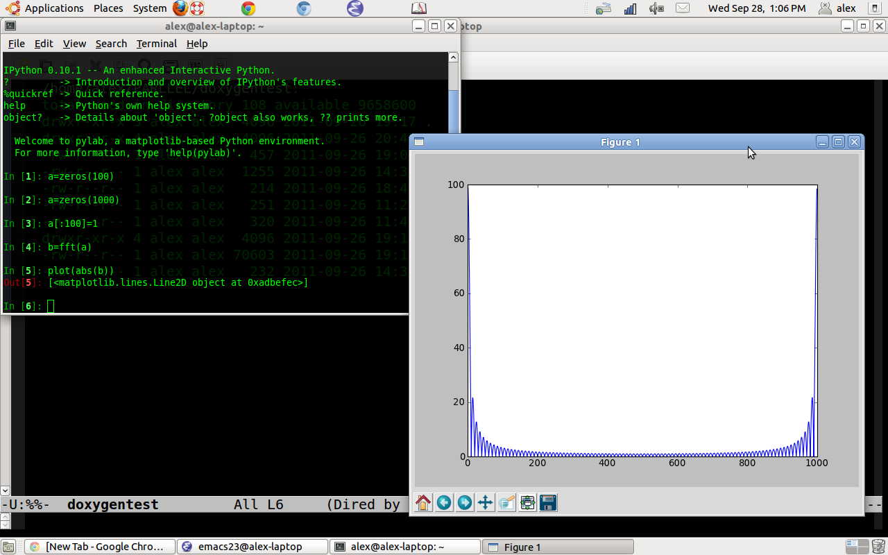
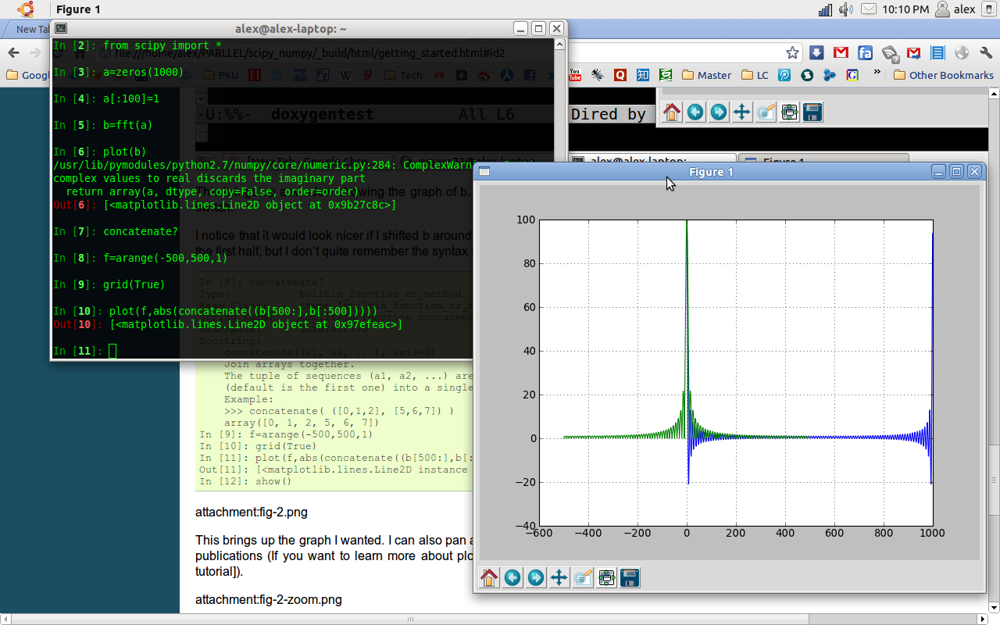

************************************************
Scipy入门
************************************************

本章节主要内容来自 `Getting Started <http://scipy.org/Getting_Started>`_ 。翻译的其中一部分，并加入了一些我的心得体会。

什么是scipy，numpy，matplotlib 
=====================================

:Python: 是一种广泛意义上的编程语言。它非常适合做交互式的工作，并且足够强大可做大型应用。

:Numpy: 是python的一个扩展，它定义了数组和矩阵，以及作用在它们上面的基本操作。

:Scipy: 是另一个python的扩展包。它利用numpy做更高级的数学，信号处理，优化，统计等等。

:Matplotlib: 是一个作图的python扩展包。

它们能干什么？
==============================

Scipy 和它的弟兄们可以做很多事情：

 * 首先，它可以做深度的数学数值计算。做矩阵计算，算特征值，算积分，算微分方程。

 * Numpy的array 类（实现matrix类的基础）充分考虑了效率，所以它比python本身自带的list数据结构要快很多。
   而且，类似他实现了类似matlab里面的矩阵操作，可以省掉很多循环。
   例如，通常的Python： 
   
   .. literalinclude:: src/c1.py
   
   在几GHz的cpu上这个循环通常需要跑5-10秒。而使用numpy。
   
   .. literalinclude:: src/c2.py
   
   不仅易读，而且执行的更快,快很多。
 
 * There is a sizeable collection of both generic and application-specific numerical code written in or using numpy and scipy.  See the  `Topical Software index <http://scipy.org/Topical_Software>`_ for a partial list. Python 有许多模块可以开发交互应用例如 `TraitsUI <http://scipy.org/TraitsUI>`_ 和 `wxPython <http://scipy.org/Cookbook/wxPython_dialogs>`_ 结合scipy，就可以开发出很好的交互式应用了。
 * Using  `ipython <http://ipython.scipy.org/>`_ makes interactive work easy. Data processing, exploration of numerical models, trying out operations on the fly allows to go quickly from an idea to a result (see the `article on ipython <https://cirl.berkeley.edu/fperez/papers/ipython-cise-final.pdf>`_ ).
 * 使用 `matplotlib <http://matplotlib.sourceforge.net/>`_  来画出高质量的图。With it you can turn your data or your models into figures for presentations or articles. No need to do the numerical work in one program, save the data, and plot it with another program.

How to work with scipy 
==============================
.. index::
   single: python

Python is a language, it comes with several user interfaces. There is no single program that you can start and that gives an integrated user experience. Instead of that there are dozens of way to work with python.

The most common is to use the advanced interactive python shell `ipython` to enter commands and run scripts. Scripts can be written with any text editor. 

我的选择是 直接在terminal里面运行，emacs编写。

Neither scipy nor numpy provide, by default, plotting functions. They are just numerical tools. The recommended plotting package is  `matplotlib`.

Under Windows, Mac OS X, and Linux, all these tools are provided by the `Enthought Python Distribution <http://www.enthought.com/products/epd.php>`_ . 更多关于安装请查看 `Installing <http://scipy.org/Installing_SciPy>`_ 在下面的例子里，除了scipy包，还需要安装ipython和一个图形界面的backend，我安装的是tk。

学习scipy 
==============================
.. index::
   single: learning scipy

这可能是一个比较好的快速上手的教程 `Tutorial:tutorial focused on interactive data analysis <http://scipy.org/Additional_Documentation/Astronomy_Tutorial>`_ 

.. 这次作业后面的具体学习部分主要以此为参考。

中文的教程的话，HYRY Studio 的 `用Python做科学计算 <http://hyry.dip.jp/pydoc/index.html>`_ 以及其 `实例集 <http://hyry.dip.jp:8000/>`_  应该是比较完整的一个中文教程了。 

To learn more about the python language, the python tutorial will make you familiar with the python syntax and objects. You can download this tutorial from http://docs.python.org/download.html .

我最早就是直接看的官方手册里面的tutorial学的python，很快就上手了，里面也包括了python的C扩展的教程，在python安装包里面就应该有这个官方手册。

Dave Kuhlman's course on numpy and scipy is another good introduction: http://www.rexx.com/~dkuhlman/scipy_course_01.html

The `Documentation <http://docs.scipy.org>`_  and ["Cookbook"] sections of this site provide more material for further learning.

先看点简单的例子
==============================

这里给出的是用ipython的例子，可以不用显示声明所用数组是numpy里的array。直接用python的交互也是类似的，ipython只是有一些扩展功能，具体介绍请看下章。

Interactive work(交互方式)
------------------------------

Let's look at the Fourier transform of a square window. To do this we are going to use ipython, an interactive python shell. As we want to display our results with interactive plots, we will start ipython with the "-pylab" switch, which enables the interactive use of `matplotlib`::
    
 $ ipython -pylab
 Python 2.5.1 (r251:54863, May  2 2007, 16:27:44)
 Type "copyright", "credits" or "license" for more information.
 IPython 0.7.3 -- An enhanced Interactive Python.
 ?       -> Introduction to IPython's features.
 %magic  -> Information about IPython's 'magic' % functions.
 help    -> Python's own help system.
 object? -> Details about 'object'. ?object also works, ?? prints more.
	  Welcome to pylab, a matplotlib-based Python environment.
  	  For more information, type 'help(pylab)'.

Ipython offers a great many convenience features, such as tab-completion of python functions and a good help system::
        
 In [1]: %logstart
 Activating auto-logging. Current session state plus future input saved.
 Filename       : ipython_log.py
 Mode           : rotate
 Output logging : False
 Raw input log  : False
 Timestamping   : False
 State          : active

This activates logging of the session to a file. The format of the log file allows it to be simply executed as a python script at a later date, or edited into a program. Ipython also keeps track of all inputs and outputs (and makes them accessible in the lists called In and Out), so that you can start the logging retroactively::
    
 In [2]: from scipy import *

Since numpy and scipy are not built into python, you must explicitly tell python to load their features. Scipy provides numpy so it is not necessary to import it when importing scipy.

Now to the actual math::

 In [3]: a = zeros(1000)
 In [4]: a[:100]=1

The first line simply makes an array of 1000 zeros, as you might expect; numpy defaults to making these zeros double-precision floating-point numbers, but if I had wanted single-precision or complex numbers, I could have specified an extra argument to zeros. The second line sets the first hundred entries to 1.

I next want to take the Fourier transform of this array. Scipy provides a fft function to do that::

    In [5]: b = fft(a)

In order to see what b looks like, I'll use the matplotlib library. If you started ipython with the "-pylab" you do not need to import matplotlib. Elsewhere you can import it with: "from pylab import \* ", but you will not have interactive functionality (the plots displays as you create them)::

 In [6]: plot(abs(b))
 Out[6]: [<matplotlib.lines.Line2D instance at 0xb7b9144c>]
 In [7]: show()

这里要在新窗口中显示图片需要设置matplotlib的backends。我用的是TkAgg，这需要安装tk

This brings up a window showing the graph of b. The show command on input "[7]" is not necessary if you started ipython with the "-pylab" switch.

I notice that it would look nicer if I shifted b around to put zero frequency in the center. I can do this by concatenating the second half of b with the first half, but I don't quite remember the syntax for concatenate::

 In [8]: concatenate?
 Type:           builtin_function_or_method
 Base Class:     <type 'builtin_function_or_method'>
 String Form:    <built-in function concatenate>
 Namespace:      Interactive
 Docstring:
     concatenate((a1, a2, ...), axis=0)
     Join arrays together.
     The tuple of sequences (a1, a2, ...) are joined along the given axis
     (default is the first one) into a single numpy array.
     Example:
     >>> concatenate( ([0,1,2], [5,6,7]) )
     array([0, 1, 2, 5, 6, 7])
 In [9]: f=arange(-500,500,1)
 In [10]: grid(True)
 In [11]: plot(f,abs(concatenate((b[500:],b[:500]))))
 Out[11]: [<matplotlib.lines.Line2D instance at 0xb360ca4c>]
 In [12]: show()

This brings up the graph I wanted. I can also pan and zoom, using a set of interactive controls, and generate postscript output for inclusion in publications (If you want to learn more about plotting, you are advised to read the `matplotlib tutorial <http://matplotlib.sourceforge.net/tutorial.html>`_ ).

Running a script（脚本方式）
------------------------------

When you are repeating the same work over and over, it can be useful to save the commands in a file and run it as a script in ipython. You can quit the current ipython session using "ctrl-D" and edit the file ipython_log.py. When you want to execute the instructions in this file you can open a new ipython session an enter the command "%run -i ipython_log.py".
这里ipython将刚才的命令记录在了ipython_log.py中了。

It can also be handy to try out a few commands in ipython, while editing a script file. This allows to try the script line by line on some simple cases before saving it and running it.

Some notes about importing
------------------------------
.. index::
   single: import

用import 加载程序包的时候的一点细节，值得注意一下，关乎加载的效率。

The following is not so important for you if you are just about to start with scipy & friends and you shouldn't worry about it. But it's good to keep it in mind when you start to develop some larger applications.

For interactive work (in ipython) and for smaller scripts it's ok to use::

 from scipy import *

This has the advantage of having all functionallity in the current namespace ready to go. However, for larger programs/packages it is advised to import only the functions or modules that you really need. Lets consider the case where you (for whatever reason) want to compare numpy's and scipy's *fft* functions. In your script you would then write::

 #!python numbers=disable
 # import from module numpy.fft
 from numpy.fft import fft
 # import scipy's fft implementation and rename it;
 # Note: `from scipy import fft` actually imports numpy.fft.fft (check with
 # `scipy.fft?` in Ipython or look at .../site-packages/scipy/__init__.py)
 from scipy.fftpack import fft as scipy_fft

The advantage is that you can, when looking at your code, see explicitly what you are importing, which results in clear and readable code. Additionally, this is often faster than importing everything with::

 import *

especially if you import from a rather large package like scipy.

However, if you use many different numpy functions, the import statement would get very long if you import everything explicitly.  But instead of using "import \*" you can import the whole package::

 #!python numbers=disable
 from numpy import *  # bad
 from numpy import abs, concatenate, sin, pi, dot, amin, amax, asarray, cov, diag, zeros, empty, exp, eye, kaiser # very long
 import numpy         # good
 # use numpy.fft.fft() on array 'a'
 b = numpy.fft.fft(a)

This is ok since usually::

 import numpy 

is quite fast. Scipy, on the other hand, is rather big (has many subpackages). Therefore::

 from scipy import *

can be slow on the first import (all subsequent import statements will be executed faster because no re-import is actually done). That's why the importing of subpackages (like *scipy.fftpack*) is disabled by default if you say *import scipy*, which then is as fast as *import numpy*. If you want to use, say *scipy.fftpack*, you have to import it explicitly (which is a good idea anyway). If you want to load all scipy subpackges at once, you will have to do::

 import scipy; 
 scipy.pkgload()

For interactive sessions with Ipython, you can invoke it with the scipy profile::

 ipython -p scipy

which reads the scipy profile rc file  (usually ~/.ipython/ipythonrc-scipy) and loads all of scipy for you.  For a ready-to-go interactive environment with  scipy and matplotlib plotting, you would use something like:: 

 ipython -pylab -p scipy

For a general overview of package structuring and "pythonic" importing conventions, take a look at `this part of the Python tutorial <http://www.python.org/doc/2.5.4/tut/node8.html#SECTION008400000000000000000>`_ 

